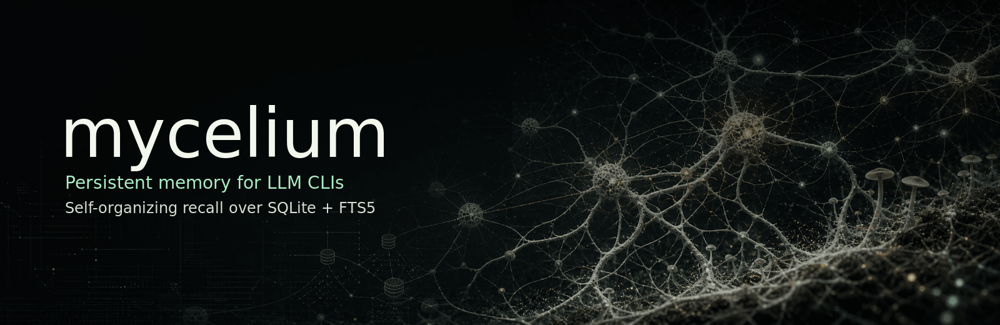

# mycelium

**Persistent memory for LLM CLIs that behaves like a brain instead of a database.**

Things you reference stay strong. Things you ignore fade. Similar ideas link
themselves through use. The shape of your knowledge emerges from how you
actually work — you don't curate folders or maintain an index.

Single-process MCP server, SQLite + FTS5, zero external services. Works with
Claude Code, Claude Desktop, Codex CLI, or any MCP-speaking client. They can
all share the same memory store.

## Why you might want this

- **Conversations stop being disposable.** What you taught the model on Tuesday
  is what it knows on Friday. No re-explaining your project structure every
  session.
- **Cross-tool continuity.** Lessons from your Claude session are visible to
  your Codex session. The memory store is the agent's, not any one CLI's.
- **It self-organizes.** No tags, no folders. The network shape comes from
  what you actually use; the rest decays. You don't manage it.
- **It's just files.** One SQLite database for memories, one for decisions,
  one TOML config. Back it up, copy it, version it, delete it.
- **No services to run.** No accounts, no API keys, no telemetry. Stays on
  your machine unless you explicitly run it on a network you control.

## What it does

Two memory systems in one install:

- **Semantic memory** — the durable "what I know" store. Save observations,
  decisions, project facts, conventions. Recall them later by natural-language
  query. Connections form automatically through co-access; unused paths decay.
- **Behavioral memory (foundry)** — append-only log of decisions. "Picked the
  cheaper model tier for this prompt size." Queryable later for pattern
  analysis or training-data extraction. Optional; turn off if unused.

Plus two slash-skill conventions and a short-term memory hook for Claude Code:

- **`/checkpoint`** — save the current session's state to memory before
  `/clear`. Resume next time exactly where you left off.
- **`/maintain`** — periodic janitor pass (snapshot, cold-mark duplicates,
  rescue orphans) with safety guards. Dry-run by default; asks before applying.
- **STM hook** — a 6-entry buffer of operational lessons that get injected
  *before* matching tool runs, so Claude sees the workaround before hitting
  the same wall again.

> **Want the full mental model before installing?** Read
> [docs/concepts.md](docs/concepts.md) — what each tool is *for* in plain
> language, what conventions like `[session-checkpoint]` mean, the
> gardener-not-librarian framing. ~10 minutes, no commands.

## What a session feels like

https://github.com/user-attachments/assets/2a274f61-24e8-4eed-82a2-f3dbe75126cd

Save a fact → `/checkpoint` → `/clear` → fresh session pulls it right back
via `context()` and `recall()`. ~50 seconds.

If you'd rather read it as a transcript:

```
You:    [start of a new session]
Claude: [calls context() automatically — sees your project hubs]
        "Looks like we're in the middle of acme-api. The OAuth refactor is at
         step 3 and you mentioned the staging migration is next."

You:    "Right. Let's pick that up."
Claude: [calls recall("staging migration acme-api")]
        "OK — last session you confirmed the schema change goes in 0042 and
         we agreed to use a backfill column. Want me to start there?"

You:    "Yes, and remember the column should default to FALSE not NULL."
Claude: [calls save("acme-api migration columns default FALSE not NULL — was
         a source of bugs last quarter", project="acme-api", pinned=true)]
        "Saved and pinned."
```

No tags, no folders, no manual recall queries from you. The agent reaches
for the tools because the MCP server told it to and because the conventions
in [docs/concepts.md](docs/concepts.md) are its mental model.

## Install

### Easiest: have Claude do it

You already have Claude Code installed (it's how you'll use this). Paste this
prompt into a Claude Code session — it detects your OS, picks the install
method, runs the smoke test, and wires up the MCP. Read the actions before
approving.

````
Install the mycelium memory MCP server from
https://github.com/constant-itis/mycelium-memory.

Constraints:
- Detect OS (Linux / macOS / Windows) and adapt commands accordingly.
- Require Python 3.11+. If missing, STOP and tell me to install Python first.
- Prefer `pipx install ...`. Fall back to `pip install --user ...`
  (or `py -m pip install --user ...` on Windows) if pipx is unavailable.
- NEVER use sudo. NEVER use --break-system-packages without confirming with me.
- Use `pip install git+https://github.com/constant-itis/mycelium-memory`
  (or the pipx equivalent) — this isn't on PyPI yet.
- After install, run the smoke test:
  curl -sL https://raw.githubusercontent.com/constant-itis/mycelium-memory/main/scripts/smoke-test.sh | bash
  (Use Git Bash / WSL on Windows.)
- If the smoke test passes, register with Claude Code:
  claude mcp add mycelium -- mycelium serve
  Then verify with: claude mcp list
- Optional follow-ups — ASK ME before doing any of these:
  1. Append the CLAUDE.md primer (docs/claude-md-primer.md) to my CLAUDE.md.
  2. Install the /checkpoint, /maintain, and /discover skills (clone the
     repo, symlink each skills/<name> dir into ~/.claude/skills/).
  3. Install the STM hook (clone the repo, run hooks/stm/install.sh —
     requires jq).

Report back: what got installed, where, and which optional steps you'd
recommend based on my environment.
````

### Manual

```bash
# Pick one path:
pipx install git+https://github.com/constant-itis/mycelium-memory       # cleanest
pip install --user git+https://github.com/constant-itis/mycelium-memory # if no pipx

# Verify (uses a throwaway temp dir; touches no user state):
curl -sL https://raw.githubusercontent.com/constant-itis/mycelium-memory/main/scripts/smoke-test.sh | bash

# Wire into Claude Code:
claude mcp add mycelium -- mycelium serve
```

**Windows:** substitute `py -m pip ...` for `pip ...`. The bash scripts
(`smoke-test.sh`, `hooks/stm/install.sh`) need Git Bash or WSL.

**Hit `error: externally-managed-environment` (PEP 668)?** Use `pipx`, or
add `--break-system-packages` to the pip command (safe with `--user`).

**`mycelium: command not found` after install?** Add `~/.local/bin` (Linux/Mac)
or `%APPDATA%\Python\Python311\Scripts` (Windows) to `$PATH`. `pipx` handles
this automatically.

## Once it's installed

In rough order of "what new users do next":

| Want to... | Read |
|---|---|
| Understand the whole system | [docs/concepts.md](docs/concepts.md) |
| Have Claude follow consistent rituals | [docs/claude-md-primer.md](docs/claude-md-primer.md) — paste into your CLAUDE.md |
| Bootstrap with existing material | [docs/seeding.md](docs/seeding.md) — paste-prompts for seeding from CLAUDE.md, project trees, notes, shell history |
| Tune behavior or change paths | [docs/configuration.md](docs/configuration.md) |
| Hook up Claude Desktop, Codex, or another MCP client | [Multi-client setup](#multi-client-and-other-mcp-clients), below |
| Read the longer thinking behind this | [docs/research/](docs/research/) — paper-form notes on memory governance for long-running agent systems |

## Multi-client and other MCP clients

Mycelium is a vanilla MCP server. Anything that speaks MCP can connect.
Lessons from your morning Claude session show up in your afternoon Codex
session — same SQLite, same memories.

### Claude Desktop App

Edit `~/Library/Application Support/Claude/claude_desktop_config.json` (macOS)
or `%APPDATA%\Claude\claude_desktop_config.json` (Windows):

```json
{ "mcpServers": { "mycelium": { "command": "mycelium", "args": ["serve"] } } }
```

Restart the app.

### Codex CLI

Add to `~/.codex/config.toml`:

```toml
[mcp_servers.mycelium]
url = "http://localhost:8200/mcp"

# Optional: gate write tools behind approval prompts
[mcp_servers.mycelium.tools.save]
approval_mode = "approve"
```

Codex uses HTTP, so start the server first:

```bash
mycelium serve --transport http --port 8200 &
```

### Multi-client mechanics

- **Same machine, multiple stdio clients** — each spawns its own server
  process, both hit the same `~/.mycelium/memory.db`. SQLite WAL handles it.
  Just works.
- **Multiple machines** — run one HTTP server, point each client at it.

> **Security:** the MCP server has no auth. Bind HTTP transport to
> `127.0.0.1` for one machine, or to a private interface (Tailscale, LAN)
> for trusted multi-machine. Don't expose it to the public internet.

## Backups

Your data lives in `~/.mycelium/memory.db` (semantic) and
`~/.mycelium/foundry.db` + `~/.mycelium/foundry/logs/*.jsonl` (behavioral).
Back them up like any other important file. The JSONL files are the durable
source for foundry — if you lose `foundry.db`, re-ingest from JSONL with
`mycelium foundry ingest`.

## Troubleshooting

| Symptom | What to check |
|---|---|
| `mycelium: command not found` | `~/.local/bin` not on `$PATH`. `pipx` avoids this; otherwise add it manually. |
| `ModuleNotFoundError: No module named 'mcp'` | Install incomplete or wrong Python. `python3 -c "import mcp"` should succeed. |
| `error: externally-managed-environment` | PEP 668 wall on Debian/Ubuntu/Fedora. Use `pipx` or `--break-system-packages`. |
| MCP doesn't appear in Claude | Restart Claude Code. `claude mcp list` confirms registration. Run `mycelium serve` directly to see startup errors. |
| `database is locked` | Rare WAL contention. Retry. Check no zombie `mycelium serve` is still running. |
| Config not behaving like the file says | `mycelium config` shows what's actually resolved + the source. Env vars override file values. |
| `recall()` returns nothing for something I saved | Check the `project` field — recall is project-scoped when you pass `project=`. |

## License

AGPL-3.0-or-later. See [LICENSE](LICENSE).

For commercial use without AGPL obligations, contact constantitis@gmail.com.
